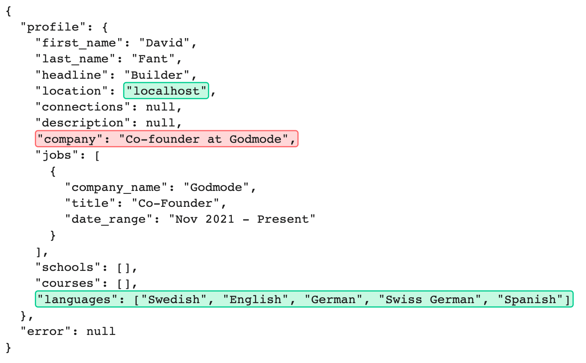

# JSON Text Annotation Parser

This repo is useful for parsing text annotations of JSON documents and converting that to annotated paths in the JSON document.

## Usage
The following example has been annotated using [Retool's Annotated Text component](https://retool.com/components/annotated-text)



The following code:
```python
from json_text_annotation_parser import parse, TextAnnotation

data = {
  "profile": {
    "first_name": "David",
    "last_name": "Fant",
    "headline": "Builder",
    "location": "localhost",
    "connections": None,
    "description": None,
    "company": "Co-founder at Godmode",
    "jobs": [
      {
        "company_name": "Godmode",
        "title": "Co-Founder",
        "date_range": "Nov 2021 - Present"
      }
    ],
    "schools": [],
    "courses": [],
    "languages": [
      "Swedish",
      "English",
      "German",
      "Swiss German",
      "Spanish",
    ]
  }
}

annotations = [
  TextAnnotation(start=112, end=123),
  TextAnnotation(start=179, end=213),
  TextAnnotation(start=403, end=505),
]

parsed = parse(data, annotations)
```

Would output:
```JSON
[
  ["profile", "location"],
  ["profile", "company"],
  ["profile", "languages"]
]
```
